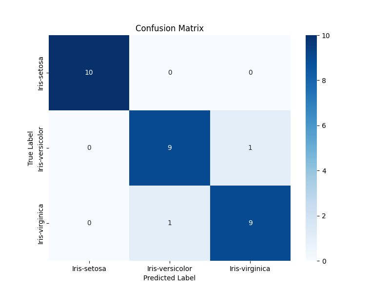

# Advanced Iris Classifier: A Production-Focused Workflow 🌿

### Project Overview

This project reimagines the classic Iris dataset classification problem. Instead of a simple notebook, the focus here is on applying a modern, end-to-end machine learning workflow, demonstrating practices used in professional data science environments.

The simplicity of the Iris data allows the methodology to be the star of the show. The goal was to build a system that is not only accurate but also robust, reproducible, and ready for deployment.

---

### The Technical Workflow

This project was built with a production-first mindset, emphasizing best practices at each step.

1.  **Encapsulated Pipeline**: Preprocessing and modeling steps were bundled into a single `scikit-learn` **Pipeline**. This is critical for preventing data leakage and creating a streamlined, deployable artifact.

2.  **Advanced Modeling**: The model of choice is **XGBoost**, a powerful gradient boosting library known for its performance and wide adoption in the industry.

3.  **Automated Optimization**: **GridSearchCV** was used to systematically search for the optimal model hyperparameters, ensuring the final model is tuned for peak performance rather than relying on default settings.

4.  **Interactive Deployment**: The final, trained pipeline was deployed as a user-friendly web application using **Streamlit**, allowing for real-time predictions and demonstrating the project's end-to-end completion.

---

### Final Model Performance

The confusion matrix shows the high accuracy of the tuned XGBoost model on the held-out test set.



---

### Technology Stack

* **Modeling & Data**: `scikit-learn`, `XGBoost`, `pandas`
* **Deployment**: `Streamlit`, `joblib`
* **Visualization**: `Matplotlib`, `Seaborn`

---

### Running the Project Locally

1.  **Clone the Repository**:
    ```bash
    git clone https://github.com/Udayan6611/CODSOFT/tree/main/IRIS_Flower_Classification.git
    cd IRIS_Flower_Classification
    ```

2.  **Install Dependencies**:
    ```bash
    pip install -r requirements.txt
    ```

3.  **Launch the App**:
    ```bash
    streamlit run app.py
    ```

---

### `requirements.txt`

pandas
scikit-learn
xgboost
matplotlib
seaborn
joblib
streamlit