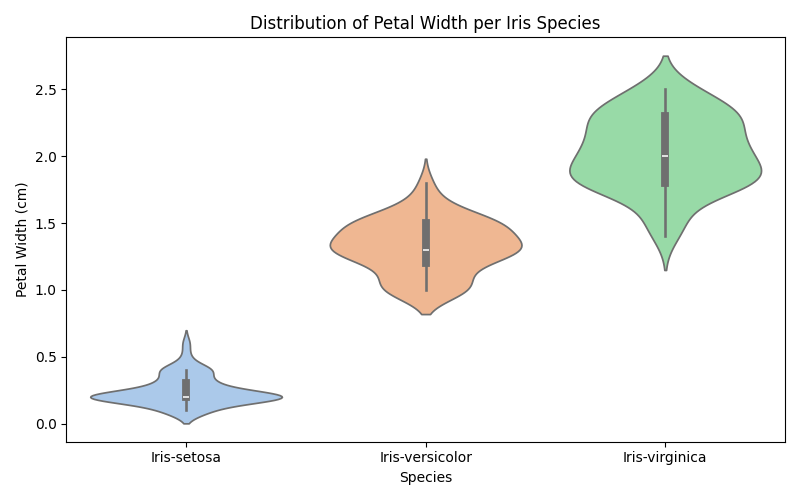
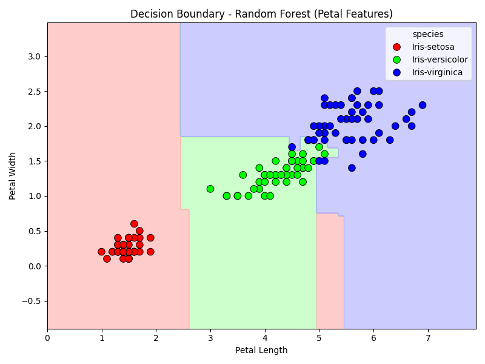

Task 3: Iris Flower Classification 🌸

📍 CodSoft Data Science Internship – July 2025

🔰 Why This Project?
As someone new to data science, I wanted to pick a dataset that would help me understand the entire ML pipeline — from cleaning data to deploying a model. The Iris dataset is classic for a reason: it's clean, simple, and easy to visualize.
This task helped me learn the actual workflow behind classification models, not just code.

💼 What I Did?
- Explored the dataset using boxplots, histograms, and pairplots  
- Experimented with 3 models: Logistic Regression, k-Nearest Neighbors, and Random Forest  
- Random Forest gave perfect results, so I saved and deployed it via Streamlit  
- Created visualizations like confusion matrix and decision boundary  
- Learned how to save models with joblib and load them into a web app

🧠 What I Learned?
- How to preprocess numeric features
- What accuracy, precision, recall actually mean in real examples
- That even simple datasets can teach deep concepts
- And how to make my models interactive with just a few lines of Streamlit code

📊 Visual Insights
| Plot | Description |
|------|-------------|
|  | Petal width varies clearly between species |
|  | Shows how model separates the species |

🧪 Try the App Yourself
Clone the repo and run this command:
in cmd:
streamlit run streamlit_app.py

✅ The app lets you input flower measurements and see which species it predicts.

Requirements:-
(save in requirements.txt)
pandas
numpy
matplotlib
seaborn
scikit-learn
joblib
streamlit

🛠️ How to Run This Project:-
in cmd:
git clone https://github.com/yourusername/CODSOFT.git
cd CODSOFT/IRIS_Flower_Classification
pip install -r requirements.txt
streamlit run streamlit_app.py

🎯 Reflection:-
Even though it's a beginner dataset, I treated it like a real-world problem — with clean code, meaningful visuals, and deployment. I didn’t want this to feel like “just another Iris notebook”.

On to Task 1 next! 🚢

⭐ This is Task 3 of my CodSoft Internship. I’ll be sharing more soon!
