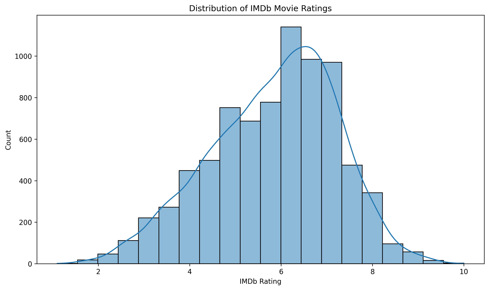
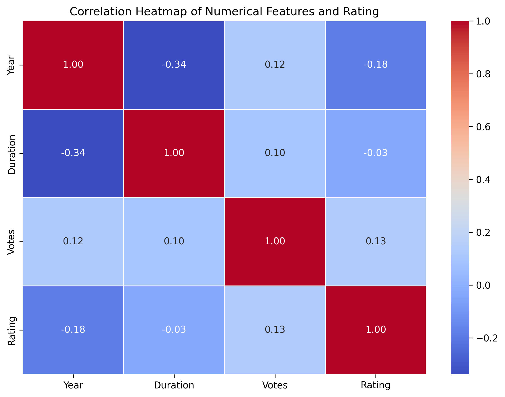
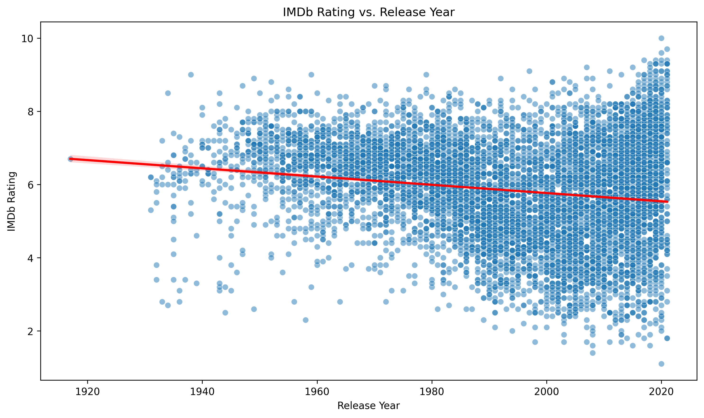
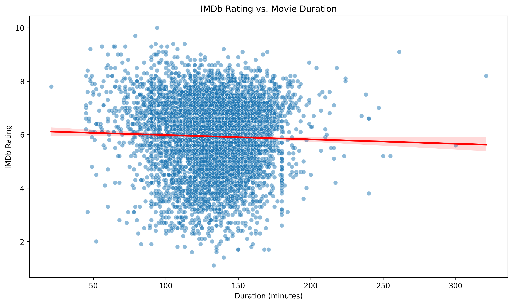
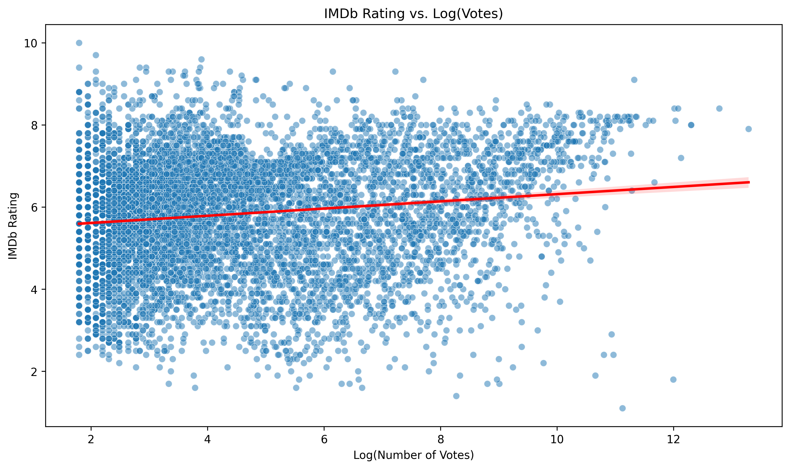
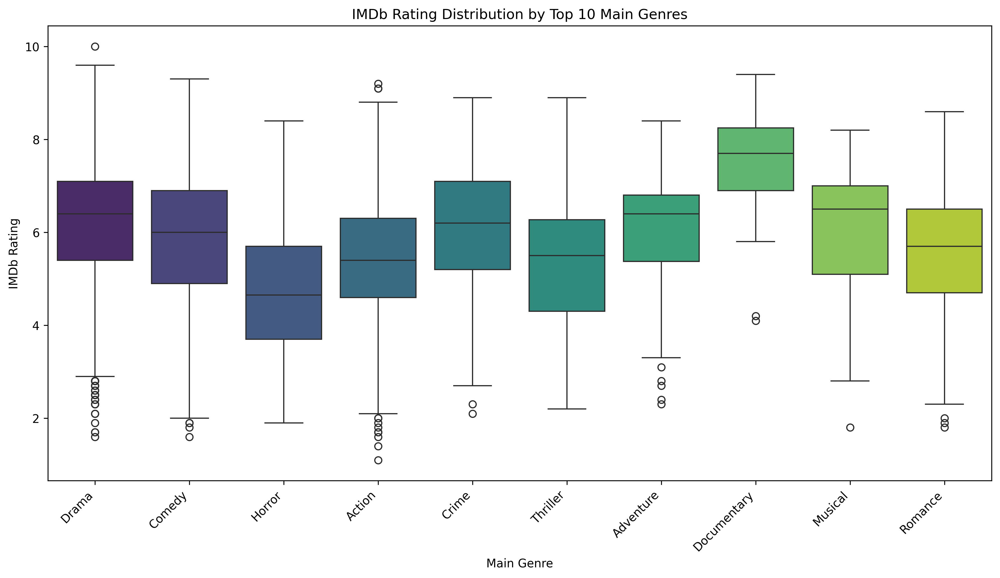
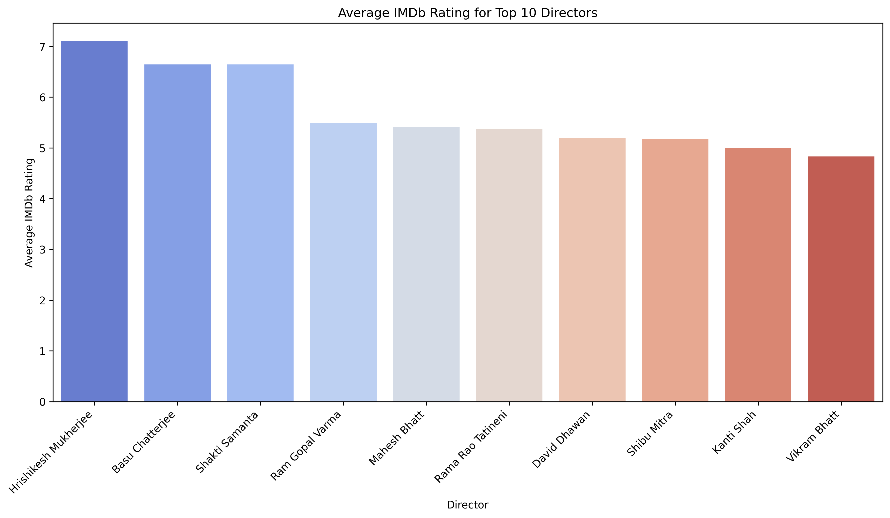

# Movie Rating Prediction with Python

End-to-end machine learning project that predicts IMDb movie ratings from structured movie metadata.

This repository includes:
- EDA and training notebook with chart exports
- best-model pipeline export for inference
- production-ready Streamlit app for public deployment
- deployment-focused setup for Streamlit Community Cloud

## Problem Statement

Can we predict IMDb rating using movie features such as:
- release year
- duration
- genre
- votes
- director

## Project Structure

```text
Movie_Rating_Prediction_With_Python/
├── IMDb_Movies_India.csv
├── movie_rating_EDA_training.ipynb
├── movie_rating_prediction_pipeline.pkl
├── model_metadata.json
├── movie_rating_app.py
├── requirements.txt
├── README.md
└── visuals/
```

## Dataset and Preprocessing

Source file: `IMDb_Movies_India.csv`

Notebook preprocessing includes:
- parsing `Year` from bracketed values like `(2019)`
- extracting numeric minutes from `Duration`
- removing commas and converting `Votes` to numeric
- filling missing text fields for `Genre` and `Director`
- dropping rows with missing target `Rating`

## EDA and Visual Analytics

Generated and saved by notebook:

1. Distribution of IMDb ratings  


2. Correlation heatmap for numeric features  


3. Rating vs release year  


4. Rating vs duration  


5. Rating vs log(votes)  


6. Rating distribution by top genres  


7. Average rating by top directors  


## Model Training and Results

Models trained and compared:
- Linear Regression
- K-Nearest Neighbors Regressor
- Random Forest Regressor
- XGBoost Regressor

Latest notebook run metrics:

| Model | RMSE | R2 |
|---|---:|---:|
| XGBoost | 1.0871 | 0.3644 |
| Random Forest | 1.1074 | 0.3404 |
| KNN | 1.1733 | 0.2595 |
| Linear Regression | 1.3673 | -0.0055 |

Selected best model: **XGBoost**

Exported artifacts:
- `movie_rating_prediction_pipeline.pkl`
- `model_metadata.json`

## Streamlit App

App file: `movie_rating_app.py`

Features:
- fast local model loading with `st.cache_resource`
- cached metadata with `st.cache_data`
- dynamic input controls driven by `model_metadata.json`
- no network dependency for inference (all local artifacts)
- cloud-friendly startup behavior

Run locally:

```bash
streamlit run movie_rating_app.py
```

## Installation

```bash
git clone https://github.com/<your-username>/Movie_Rating_Prediction_With_Python.git
cd Movie_Rating_Prediction_With_Python
python -m venv .venv
```

Windows:

```bash
.venv\Scripts\activate
```

macOS/Linux:

```bash
source .venv/bin/activate
```

Install dependencies:

```bash
pip install -r requirements.txt
```

## Reproducible Full Pipeline (Notebook)

Open and run `movie_rating_EDA_training.ipynb` from top to bottom.

It will:
- clean and prepare the dataset
- generate and save all visual charts in `visuals/`
- train and evaluate all regression models
- save best pipeline and metadata files

## Streamlit Community Cloud Deployment

1. Push this folder to GitHub.
2. Open Streamlit Community Cloud.
3. Create new app from your repository.
4. Set main file path: `movie_rating_app.py`.
5. Deploy.

Recommended for stable loading:
- keep model and metadata files inside repo
- avoid runtime downloads or API calls
- avoid network loops inside app startup
- keep heavy training logic out of app (done in notebook)
- pin dependencies in `requirements.txt`

## Resume-Friendly Notes

This project demonstrates:
- data cleaning of noisy real-world movie data
- statistical visual analysis and feature interpretation
- multi-model regression benchmarking
- deployment-ready ML app engineering with Streamlit caching
- reliable public portfolio deployment design