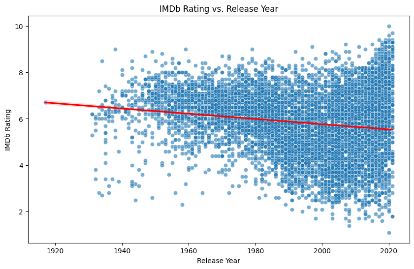
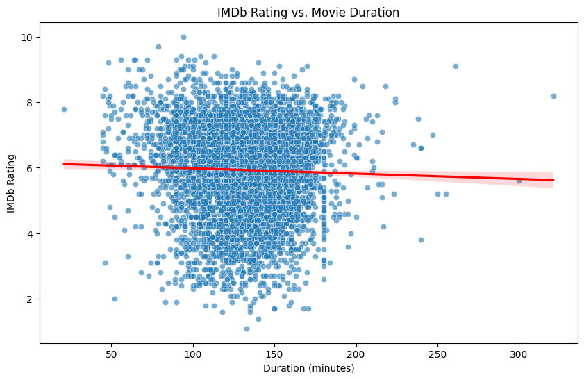
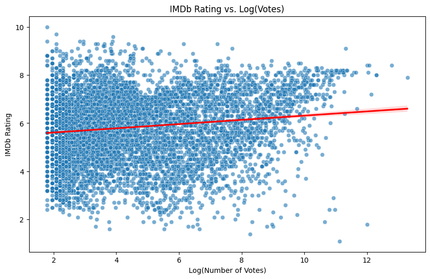

# 🎬 Movie Rating Prediction | Data Science Project

This project predicts IMDb movie ratings using real-world movie data and various machine learning regression techniques.

Going beyond basic prediction, this project:
- 📊 Visualizes how year, duration, genre, votes, and director influence movie ratings.
- 🧠 Compares multiple ML regression models and selects the best performer.
- 💡 Deploys an interactive **Streamlit app** for real-time rating prediction.

---

## 📌 Problem Statement

> Can we predict a movie's IMDb rating based on its attributes such as release year, duration, genre, number of votes, and director?

---

## 📈 Exploratory Data Analysis

Here’s how various features influenced movie ratings:

| Rating Distribution | Correlation Matrix |
|---------------------|--------------------|
|  |  |

| Rating vs. Year | Rating vs. Duration |
|-----------------|---------------------|
|  |  |

| Rating vs. Log(Votes) | Rating by Top Genres |
|-----------------------|----------------------|
|  |  |

| Average Rating by Top Directors |
|---------------------------------|
|  |

---

## 🧠 Machine Learning Models

| Model                   | Status      |
|-------------------------|-------------|
| ✅ XGBoost Regressor    | ✅ **Saved + Deployed** |
| Random Forest Regressor | ✅ Trained  |
| Linear Regression       | ✅ Trained  |
| k-NN (k=5) Regressor    | ✅ Trained  |

We trained and evaluated all four models using Root Mean Squared Error (RMSE) and R-squared ($R^2$) metrics. **XGBoost Regressor** was selected for its superior performance.

---

## 💻 Streamlit Web App (Local)

You can run the prediction app on your machine using:

```bash
streamlit run movie_rating_app.py
```

---

## Setup and Installation
To run this project locally, follow these steps:

**Clone the repository:**

```bash
git clone https://github.com/your-username/Movie_Rating_Prediction_With_Python.git
cd Movie_Rating_Prediction_With_Python
```

(Replace your-username with your GitHub username)

**Create a virtual environment (recommended):**

```bash
python -m venv venv
# On Windows:
.\venv\Scripts\activate
# On macOS/Linux:
source venv/bin/activate
```

**Install the required libraries:**

```bash
pip install pandas scikit-learn xgboost matplotlib seaborn streamlit joblib
```

---

## Usage

**1. Run the EDA and Train the Model**
Execute the movie_rating_EDA_training.py script. This will:

Perform data cleaning and preprocessing.

Generate and display the EDA visualizations (plots will open in separate windows or appear inline if in a notebook).

Train the specified machine learning models.

Evaluate their performance.

Save the best-performing model pipeline (movie_rating_prediction_pipeline.pkl) to your project directory.

python movie_rating_EDA_training.py

**2. Run the Prediction Web Application**
Once the movie_rating_prediction_pipeline.pkl file is generated, you can run the Streamlit application:

```bash
streamlit run movie_rating_app.py
``` 

This command will open the Streamlit app in your web browser, where you can input movie details and get real-time rating predictions.

---