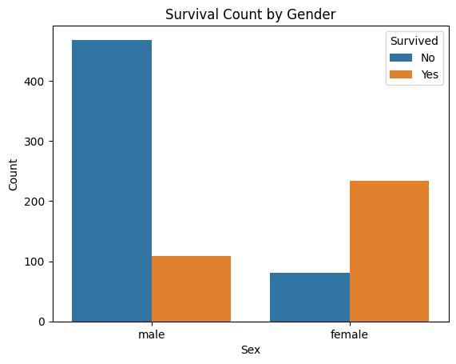
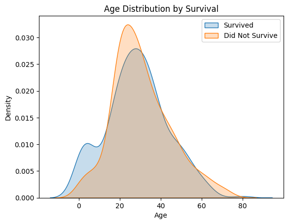
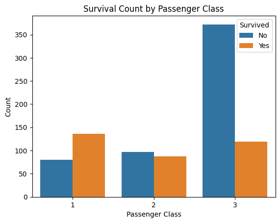
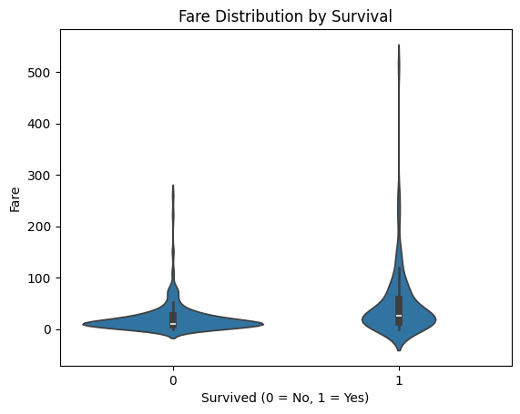
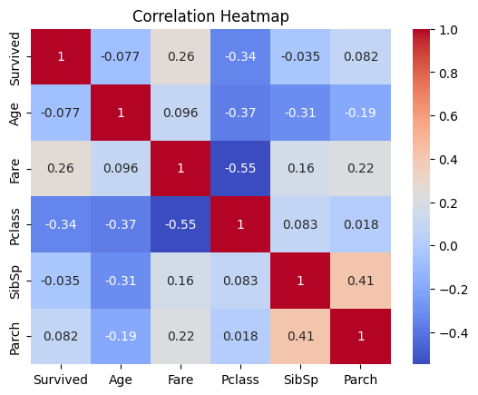

# 🚢 Titanic Survival Prediction | CodSoft Internship — Task 1

This project predicts whether a passenger would survive the Titanic disaster using real-world passenger data and machine learning techniques.

While the Titanic dataset is a classic, this version goes further than most:
- 📊 Visualizes how age, gender, fare, and class influenced survival
- 🧠 Compares three ML models and selects the best
- 💡 Deploys an interactive **Streamlit app** for real-time prediction

---

## 📌 Problem Statement

> Can we predict survival on the Titanic based on a passenger’s attributes such as age, gender, ticket class, and fare?

---

## 📈 Exploratory Data Analysis

Here’s how various features influenced survival:

| Gender-based Survival | Age Distributions |
|-----------------------|-------------------|
|  |  |

| Passenger Class Impact | Fare Distribution |
|------------------------|-------------------|
|  |  |

| Correlation Matrix |
|--------------------|
|  |

---

## 🧠 Machine Learning Models

| Model                   | Status      |
|------------------------|-------------|
| ✅ Random Forest        | ✅ **Saved + Deployed** |
| Logistic Regression     | ✅ Trained |
| k-NN (k=5)              | ✅ Trained |

We trained all three models, evaluated them using accuracy, confusion matrix, and classification report — and selected **Random Forest** for its balanced performance.

---

## 💻 Streamlit Web App (Local)

You can run the prediction app on your machine using:

```bash
streamlit run streamlit_app.py
